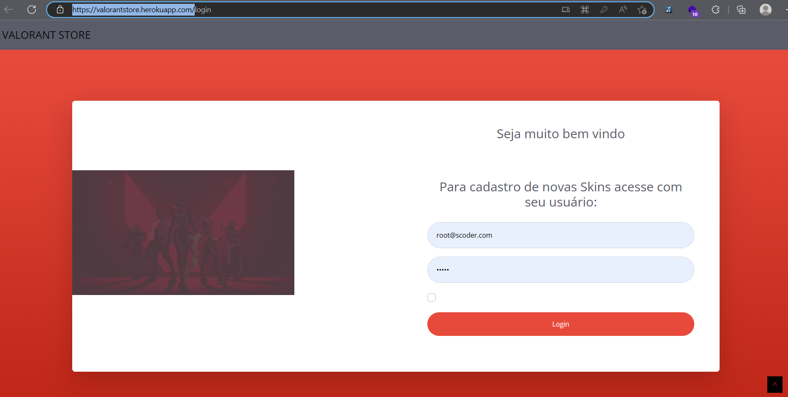

# Valorant Store

## Descrição

Este projeto é uma aplicação web feita em Java 17 + Spring Boot + Thymeleaf + MySQL 8.

## Deploy

Plataforma https:.heroku.com/

https://valorantstore.herokuapp.com/

## Banco de dados

Hospedado no https://app.planetscale.com/

## Pré-requisitos

Para executar este projeto, você precisará ter instalado em sua máquina:

- Java 11
- MySQL 8

## Instalação

1. Clone este repositório em sua máquina local
2. Abra o projeto em sua IDE de preferência
3. Todas as dependencias do projeto estão no arquivo pom.xml
4. Configure as informações de conexão com o banco de dados no arquivo "application.properties"
5. Execute o projeto

## Como executar

1. Após a instalação, execute o projeto em sua IDE de preferência
2. Via linha de comando execute o comando: ./mvnw spring-boot:run  
3. Acesse o endereço http://localhost:8080 em seu navegador

## Autor

Rodrigo Lopes

